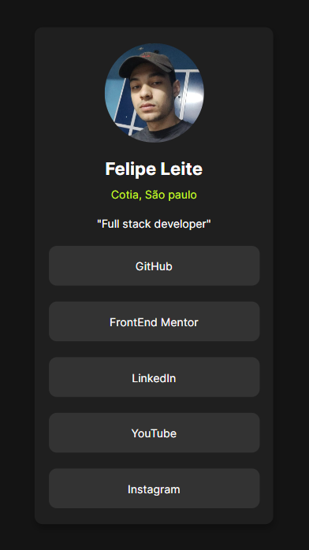

# Frontend Mentor - Social Links

Esta é uma solução para o [Social Links no Frontend Mentor](https://www.frontendmentor.io/challenges/social-links-profile-UG32l9m6dQ/hub). Os desafios do Frontend Mentor ajudam você a melhorar suas habilidades de codificação criando projetos realistas.

## Visão geral

### O desafio

O que os usuarios poderão fazer:

- Interagir com os botões e acessar os links.

### Screenshot

### Links
- Solução: [Social Links](https://7felipeleite.github.io/mini-projetos/social-links/)

## Meu processo

### Feito com

- HTML5 semantico
- CSS
- Flexbox
- CSS Grid
- Mobile First

## Autor

- Website - [Felipe Leite](https://github.com/7FelipeLeite)
- Frontend Mentor - [@7FelipeLeite](https://www.frontendmentor.io/profile/7FelipeLeite)
- Instagram - [@l.e.ite](https://www.instagram.com/l.e.ite)
